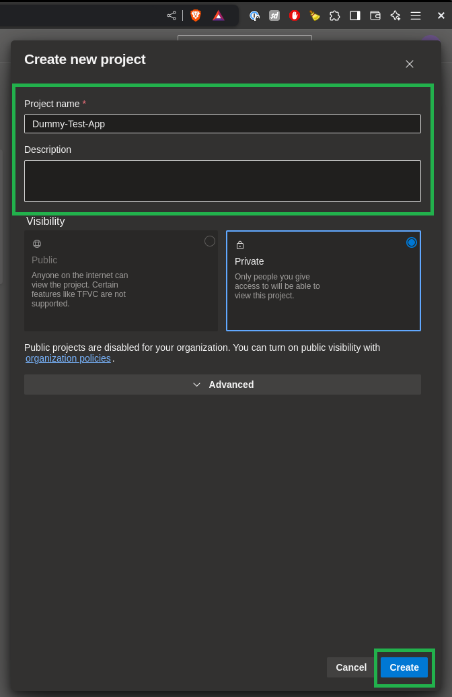
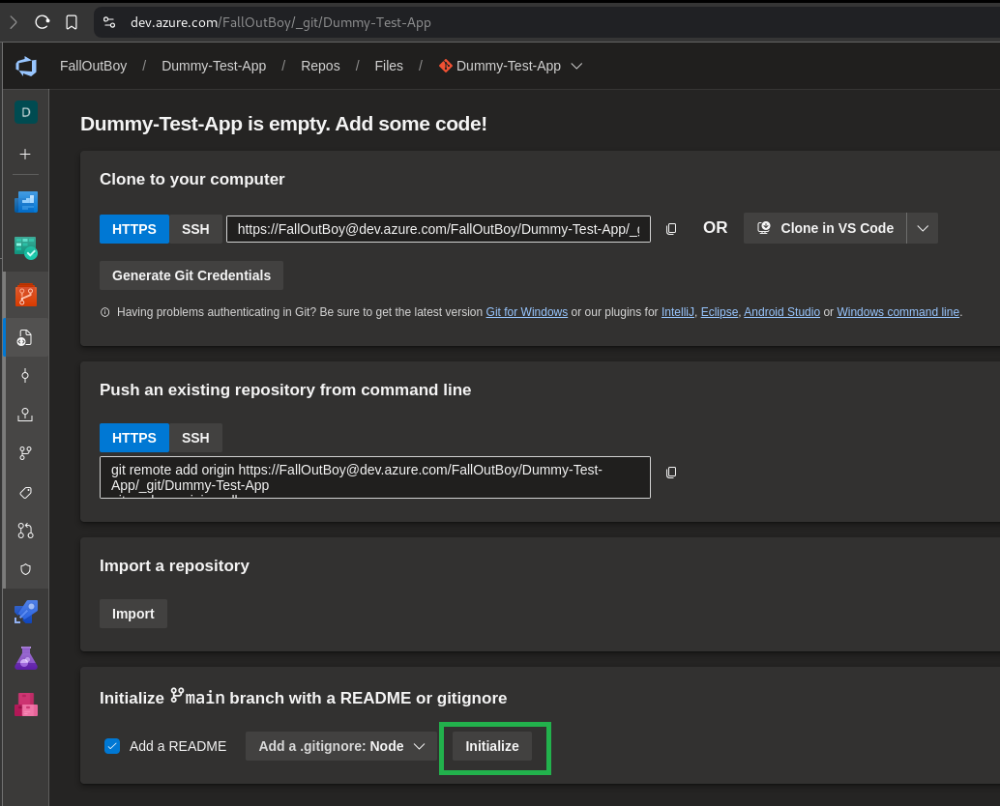
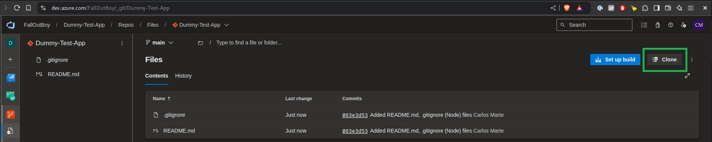
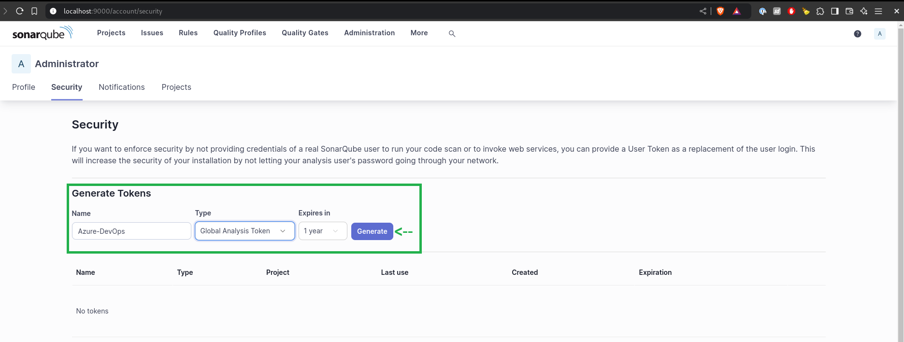
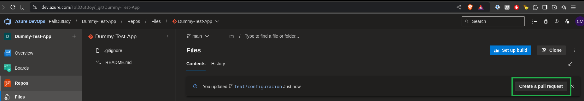
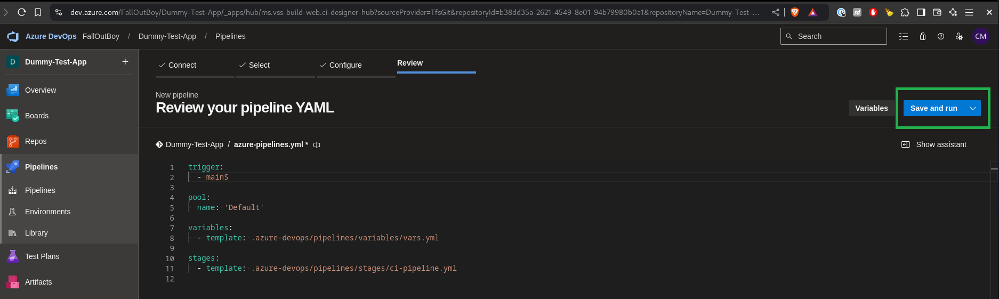
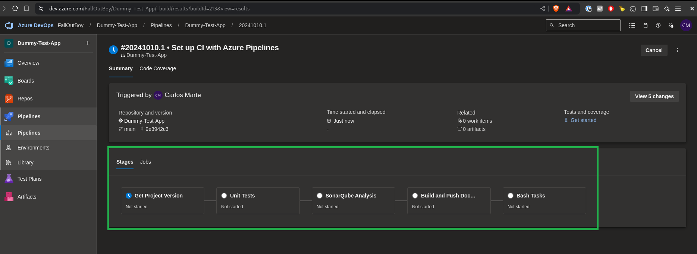
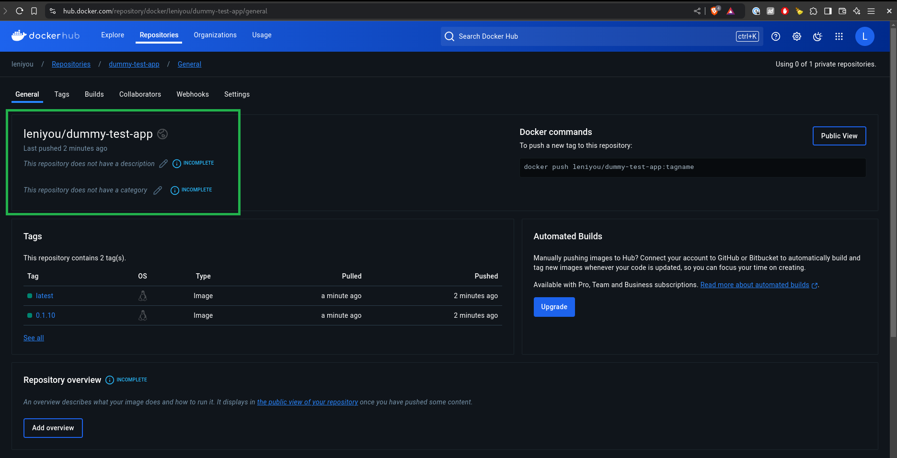
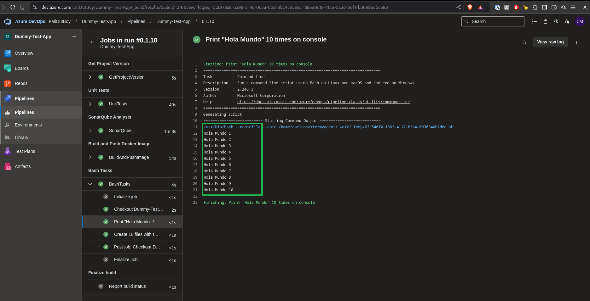
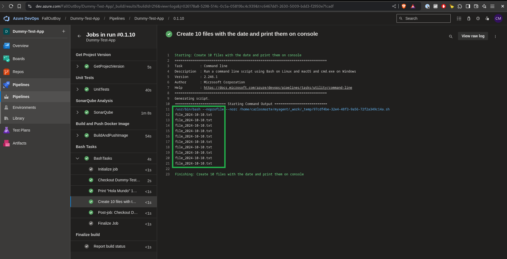

# Proyecto: Dummy Test App - Documentación

Este documento describe el proceso que se siguió para poner en marcha la aplicación Dummy Test App utilizando herramientas como SonarQube, Docker, Kubernetes, Minikube y Azure DevOps, entre otras.

## Procedimento

La prueba consiste en completar los siguientes pasos:

- Descarga los archivos del repositorio elegido.
- Instala el framework necesario en caso de no tenerlo.
- Compila la aplicación luego de pasar el analisis de sonarqube.
- Agregar dos escenarios:
  - 1 - analisis fallido
  - 2 - analisis exitoso
- Genera una imagen de docker y sube la imagen a dockerhub/ACR/ECR desde el pipeline yaml.
- Dentro del pipeline ejecute lo siguiente en bash o powershell.
  - a. Imprime Hola Mundo 10 veces en pantalla con un job paralelo.
  - b. Script que cree 10 archivos con la fecha y luego lo imprima en consola
- Despliega la app a un clúster de kubernetes (minikube o EKS o AKS).
- Crea un endpoint externo accesible (ingress) para la aplicación
- Sube al repo en una carpeta environment todos los yaml de k8s.

## Resumen

Esta prueba se realizó en entorno local basado en **Linux / Fedora 40** por lo cual los comandos de instalación y paquetes utilizados van a diferir si se quiere realizar la configuración de la aplicación en un entorno --Windows-- o --Ubuntu--

- Comandos: `sudo dnf`
- Paquetes: `.rpm`

Tambien se dá por sentado que, quien sigue esta guía, tiene conocimientos de git y ya ha trabajado con Visual Studio Code previamente, puesto que es estrictamente necesario tener ambas herramientas instaladas.

## Prerrequisitos

Para ejecutar este proyecto, es necesario contar con las siguientes herramientas instaladas:

1. **SonarQube**: Análisis de calidad del código.
   - [Instalación de SonarQube](https://docs.sonarqube.org/latest/setup/install-server/)

2. **Organización de Azure DevOps**: Gestión de código, pipelines y automatización.
   - [Creación de una organización en Azure DevOps](https://docs.microsoft.com/en-us/azure/devops/organizations/accounts/create-organization?view=azure-devops)

3. **Docker/Docker Registry/Docker Desktop**: Para crear y manejar contenedores. Poseer una cuenta en [docker hub](https://hub.docker.com/) para poder subir la imagen de la app.
   - [Instalación de Docker](https://docs.docker.com/get-docker/)

4. **Azure Agent Pool SelfHosted**: Agente de compilación en un entorno local para ejecutar tareas de CI/CD en Azure DevOps.
   - [Instalación de Self-hosted Agent en Azure DevOps](https://docs.microsoft.com/en-us/azure/devops/pipelines/agents/v2-linux?view=azure-devops)

5. **Kubernetes**: Sistema para la gestión de contenedores.
   - [Instalación de Kubernetes](https://kubernetes.io/docs/setup/)

6. **Minikube**: Minikube se utiliza para ejecutar Kubernetes localmente.
   - [Instalación de Minikube](https://minikube.sigs.k8s.io/docs/start/)

7. **Repositorio de Framework de Docker**: Para realizar las pruebas y despliegues.
   - [Ejemplos de Docker](https://docs.docker.com/samples/)

8. **Visual Studio Code**: Para escribir el código, scripts, archivos yaml y cualquier otro tipo de archivos de configuración.
   - [Visual Studio Code](https://code.visualstudio.com/)

9. **Git**: Para administrar el repositorio local y remoto.
   - [Git](https://git-scm.com/)

## Configuraciones

### 1. Configuración de Azure DevOps

Crear y configurar una organización Azure DevOps, crear un nuevo proyecto y un nuevo repositorio en la sección de Repositorios:

#### 1.1. Crear la organización de Azure DevOps

Se puede crear una organización de Azure DevOps siguiendo los pasos de este [enlace](https://docs.microsoft.com/en-us/azure/devops/organizations/accounts/create-organization?view=azure-devops).

#### 1.2. Crear el proyecto de Azure DevOps

Una vez creada la organización, crearemos el proyecto:




#### 1.3. Configurar el repositorio de Azure DevOps

Por defecto se creará un repositorio en blanco con el mismo nombre del proyecto. Debemos inicializar el repositorio y luego clonarlo a nuestro equipo:

Inicializar el repositorio



Clonar el repositorio



Repositorio en Visual Studio Code


Es buena práctica trabajar en diferentes ramas, por esto vamos a crear una rama diferente de main:

```bash
git checkout -b feat/configuracion
```

#### 1.4. Configurar el Agente de Azure DevOps Self-Hosted

Se puede crear un Agente Self-Hosted siguiendo los pasos de este
[enlace](https://docs.microsoft.com/en-us/azure/devops/pipelines/agents/v2-linux?view=azure-devops)

Una vez creado el Agente Self-Hosted se puede ver en `Settings / Agent pools / Default`


### 2. Descargar el Repositorio del Framework

Para esta prueba decidí ultilizar el framework de Node.js especificamente la app de prueba [reactnginx](https://github.com/docker/awesome-compose/tree/master/react-nginx).

Descargar el repositorio git del framework de Docker e instalar cualquier dependencia que necesite. En este caso al ser una app basada en Node.js se recomienda instalarlo para realizar algunos tareas como `npm install` o `npm run build` y así probar la app localmente primero.

```bash
git clone https://github.com/docker/awesome-compose.git
# Mover el directorio 'react-ngix' hacia el directorio de trabajo donde está el repo de Azure DevOps, por ejemplo:
mv react-ngix ~/Proyectos/Dummy-Test-App/
```

Debe lucir así:


#### 2.1. Probar la aplicación localmente

Se puede probar la aplicación localmente siguiendo estos pasos desde la terminal de Visual Studio Code:

```bash
cd react-nginx
npm install
npm run build
npm install -g serve
serve -s build
```

Este último nos indicará el URL de la aplicación: http://localhost:3000


#### 2.2. Configuración de Prueba Unitaria (opcional)

Se puede notar que la app tiene una prueba unitaria configurada para el componente *App.js*, es posible integrar esta prueba para que se ejecute al correr el CI/CD. Para hacer que funcione se necesita configurar lo siguiente:

1 - Crear un directorio **__test__** en la ruta `react-nginx/src/` y mover el archivo *App.test.js* hacia el directorio. Si aun estamos en la ruta `react-nginx/` debemos ejecutar estos comandos:

```bash
mkdir src/__test__
mv src/App.test.js src/__test__
```

2 - Editar el archivo **package.json**:

- Agregar un nuevo script al bloque *scripts: {}*
  - `"test:ci": "react-scripts test --ci --testResultsProcessor='jest-junit' --coverage --silent --watchAll=false --passWithNoTests --detectOpenHandles",`
- Agregar las dependencias de **Jest**. Para esto debemos instalar dos paquetes *jest-junit* y *jest-junit-reporter*:
  - `npm install jest-unit jest-junit-reporter --save-dev`
- Agregar la configuración de junit al package.json:

```json
"jest-junit": {
    "suiteName": "jest tests",
    "outputDirectory": "./test-results",
    "outputName": "junit.xml",
    "uniqueOutputName": "false",
    "classNameTemplate": "{classname}-{title}",
    "titleTemplate": "{classname}-{title}",
    "ancestorSeparator": " › ",
    "usePathForSuiteName": "true"
  }
```

Si se desea probar está configuración solo hay que ejecutar el comando `npm run test:ci` esto generará dos nuevos directorios (*coverage* y *test-results*) con información sobre la cobertura de código y las pruebas unitarias respectivamente.

Pruebas:


### 3. Configuración de Docker

#### 3.1. Instalar Docker Desktop

Docker Desktop se puede descargar desde este [enlace](https://www.docker.com/products/docker-desktop/)

#### 3.2. Crear una cuenta de Docker

Se puede crear una cuenta o iniciar sesión en Docker mediante este [enlace](https://app.docker.com/signup)

Con esta cuenta podemos iniciar sesión en Docker Desktop lo que será muy útil en el siguiente paso.

#### 3.3. Habilitar Kubernetes en Docker Desktop

Para habilitar Kubernetes en Docker Desktop debemos ir a *Settings > Kubernetes* y seleccionar **Enable Kubernetes**:


#### 3.4. Instalar minikube

Seguir la documentación en este [enlace](https://minikube.sigs.k8s.io/docs/start/?arch=%2Flinux%2Fx86-64%2Fstable%2Fbinary+download#Ingress) para una version actualizada.

Ejecutar:

```bash
curl -LO https://storage.googleapis.com/minikube/releases/latest/minikube-linux-amd64
sudo install minikube-linux-amd64 /usr/local/bin/minikube && rm minikube-linux-amd64

minikube start
```

Adicional agregar estos paquetes que serán de gran utilidad:

```bash
minikube dashboard
minikube addons enable ingress
minikube addons enable ingress-dns
```

### 4. Configuración de SonarQube

Ya que tenemos Docker Desktop instalado podemos instalar SonarQube en su versión contenedor. El proceso es sencillo y directo.

#### 4.1. Instalar SonarQube

- Buscamos la imagen en Docker Desktop y hacemos *Pull*:


- Cuando se descarge simplemente hacemos clic en Run y colocamos el puerto **9000**:


- Acceder al aplicativo con las credenciales `username: admin` y `password: admin`


En este punto tambien podemos crear un archivo en el root de nuestro repositorio que contenga las configuraciones basicas de SonarQube:

```bash
sonar-project.properties
```

**Con este contenido:**

```bash
sonar.projectKey=dummy-test-app
sonar.sources=react-nginx
sonar.exclusions=**/__tests__/**,**/*.test.js,**/coverage/**,**/test-results/**,**/node_modules/**
sonar.tests=react-nginx/src/__tests__
sonar.test.inclusions=**/*.test.js
sonar.javascript.lcov.reportPaths=/home/carlosmarte/myagent/_work/1/s/react-nginx/coverage/lcov.info
```

### 5. Configuración de Azure Pipeline

#### 5.1. Creación archivo **azure-pipelines.yml**

Este archivo es el que se ejecuta al correr el pipeline. Se debe crear este archivo con la siguiente estructura. Es recomendable crearlo en el root del directorio del proyecto:

```bash
touch azure-pipeline.yml
```

```yaml
trigger:
  - main

pool:
  name: 'Default'

variables:
  - template: .azure-devops/pipelines/variables/vars.yml

stages:
  - template: .azure-devops/pipelines/stages/ci-pipeline.yml
```

**Estructura del archivo:**

- `trigger`: Indica que el pipeline se debe ejecutar cada vez que se haga un merge request a la rama *main*
- `pool: name: 'Default'`: Aquí se debe colocar el Agent Pool Self-Hosted que configuramos previamente, en este caso el Default.
- `variables: - template: .azure-devops/pipelines/variables/vars.yml`: Se utiliza el archivo *vars.yml* como un template haciendo que las variables esten disponibles en cada tarea del pipeline
- `stages: - template: .azure-devops/pipelines/stages/ci-pipeline.yml`: Con esto ejecutamos el stage ci-pipeline.yml que funciona como entrypoint para ejecutar todos los demás stages.

#### 5.2. Estructura de directorios

Algunas consideraciones:

**Modularidad:** Aquí se ha optado por modular el pipeline, es decir, dividir los *stages*, *jobs* y *tasks* en directorios separados para tener un mejor manejo de cada parte del pipeline, esto tambien ayuda al mantenimiento del mismo.

**Consistencia de nombres:** Cada archivo usa una convención de nomenclatura consistente que ayuda a explicarse por si mismo, es decir, con solo ver el nombre del archivo se sabe cual es su función.

**Parámetros reutilizables:** Con esto se evita la duplicación de código innecesariamente.

**Uso centralizado de variables:** Las variables han sido centralizadas en un archivo único.

***Estructura de directorios:**

```bash
.azure-devops/
└── pipelines
    ├── jobs
    │   ├── bash-job.yml
    │   ├── build-and-push-image-job.yml
    │   ├── get-project-version-job.yml
    │   ├── sonarqube-job.yml
    │   └── unit-tests-job.yml
    ├── stages
    │   ├── bash-stage.yml
    │   ├── build-and-push-image-stage.yml
    │   ├── ci-pipeline.yml
    │   ├── get-project-version-stage.yml
    │   ├── sonarqube-stage.yml
    │   └── unit-tests-stage.yml
    ├── tasks
    │   ├── bash-task.yml
    │   ├── build-and-push-image-task.yml
    │   ├── get-project-version-task.yml
    │   ├── install-tools-and-dependencies.yml
    │   ├── sonarqube-task.yml
    │   └── unit-tests-task.yml
    └── variables
        └── vars.yml
```

| Directorio | Descripción |
| ---------- | ----------- |
| .azure-devops/pipelines | Pipelines y configuraciones relacionadas con Azure DevOps |
| .azure-devops/pipelines/jobs | Configuraciones de jobs para cada *stage* |
| .azure-devops/pipelines/stages | Configuraciones de cada *stage* del CI pipeline |
| .azure-devops/pipelines/tasks | Configuraciones de cada tarea de cada *job* |
| .azure-devops/pipelines/variables | Contiene el archivo con las variables globales que se usan durante todo el flujo del CI pipeline |

Adicional a estos directorios tambien se ha creado el directorio *scripts* que contiene un archivo bash para realizar la busqueda de la version de la app:

```bash
scripts/
└── get-project-version.sh
```

#### 5.3. Definición de tareas del pipeline

Estos son los archivos que ejecutan cada tarea del pipeline:

| Archivo | Descripción |
| ------- | ----------- |
| .azure-devops/pipelines/stages/ci-pipeline.yml | Este archivo sirve como entrypoint y es el encargado de ejecutar los demás *stages* |
| .azure-devops/pipelines/task/bash-task.yml | Tarea que a. Imprime Hola Mundo 10 veces en pantalla con un job paralelo. b. Script que cree 10 archivos con la fecha y luego lo imprima en consola. Consta simplemente de dos scripts de bash. |
| .azure-devops/pipelines/task/build-and-push-image-task.yml | Tarea para la creación y subida de la imagen al docker registry. Es necesario crear un Service Connection tipo Container Registry. |
| .azure-devops/pipelines/task/get-project-version-task.yml | Esta es una tarea opcional que obtiene la version de la app especificada en el package.json y la hace disponible durante la corrida del pipeline así otros tasks pueden hacer uso de la version. La version se puede usar para crear la imagen de Docker |
| .azure-devops/pipelines/tasks/install-tools-and-dependencies.yml | Esta es una tarea extra que instala las dependencias NPM de la app. Se usa en conjunto con la tarea de unit-test-task |
| .azure-devops/pipelines/tasks/sonarqube-task.yml | Tarea para el analisis de SonarQube |
| .azure-devops/pipelines/tasks/unit-tests-task.yml | Tarea para ejecutar las pruebas unitarias de la app |

#### 5.4. Configuracion de Service Connection en Azure DevOps

Para completar las tareas de SonarQube y Docker debemos crear unas conexiones con el aplicativo de SonarQube que recien hemos desplegado y con Docker Registry para poder hacer push de la imagen que genera el pipeline.

**Para SonarQube:**
Necesitamos instalar una extensión en nuestra organización de Azure DevOps la cual se puede descargar en este [enlace](https://marketplace.visualstudio.com/items?itemName=SonarSource.sonarqube)

- Una vez instalada la extension de *SonarQube*, volvemos al proyecto de Azure DevOps, clic en Settings / Service connections / Create service connection y seleccionamos SonarQube:
  


- Para configurar un Token, vamos a nuestro aplicativo de SonarQube clic en *Account / My Account / Security / Generate Tokens:
  


- Colocamos los datos que se solicitan en el formulario:


**Para Docker:**

- Necesitamos crear un Service Connection de tipo Docker Registry. Para ello, volvemos al proyecto de Azure DevOps, clic en Settings / Service connections / New service connection y seleccionamos *Docker Registry*.
- Colocamos los datos que se solicitan en el formulario.
  - Registry Type: Docker Hub
  - Docker ID: Es nuestro nombre de usuario de Docker Hub
  


Si todo ha salido bien solo resta correr el pipeline. Para esto debemos guardar y subir los cambios que hemos realizado en nuestro repositorio:

```bash
git commit -a -m "Preparando configuracion inicial"
git push --set-upstream origin feat/configuracion
```

Esto generará un Pull Request (solicita que los cambios de nuestra rama *feat/configuracion* se integren con la rama *main*)



Ya con los cambios en la rama *main* debemos configurar un pipeline. Para esto hacemos clic en Set up a Build / Run:



Nice!



## Procedimentos

### Compila la aplicación luego de pasar el analisis de sonarqube

**Agregar dos escenarios:**

#### Analisis fallido

Evidencia análisis fallido de SonarQube en el Pipeline:


#### Analisis exitoso

Evidencia análisis exitoso de SonarQube en el Pipeline:


Evidencia análisis exitoso de SonarQube en el Aplicativo:


### Genera una imagen de docker y sube la imagen a dockerhub/ACR/ECR desde el pipeline yaml

#### Imagen subida a Docker Hub

Evidencia imagen construida en el Pipeline:


Evidencia imagen subida a Docker Hub:



### Dentro del pipeline ejecute lo siguiente en bash o powershell

#### Imprime Hola Mundo 10 veces en pantalla con un job paralelo

Evidencia Imprimir "Hola Mundo" 10 veces:



#### Script que cree 10 archivos con la fecha y luego lo imprima en consola

Evidencia crear 10 archivos con la fecha:



### Despliega la app a un clúster de kubernetes

Para construir el cluster de Kubernetes utilicé el administrador de configuración **Kustomize**. Realicé la configuración para tres ambientes *dev,qa y prod*

**Evidencias del cluster a traves de `minikube dashboard`**

Ambiente dev:


Ambiente qa:


Ambiente prod:


### Crea un endpoint externo accesible (ingress) para la aplicación

- Para este punto usé un ingress de tipo *LoadBalancer* para configurarlo hay que editar ejecutar el comando:

```bash
kubectl edit service ingress-nginx-controller -n ingress-nginx
# buscar la entrada type y editarla
type: LoadBalancer
```

- Adicional a esto se deben agregar las URL de los host para cada ambiente:

```bash
sudo nano /etc/hosts
# agregar las siguientes líneas
127.0.0.1   dummy-test-app-dev.local
127.0.0.1   dummy-test-app-qa.local
127.0.0.1   dummy-test-app-prod.local
```

- Por ultimo ejecutar:

```bash
minikube tunnel
```

**Evidencia del ingress de tipo LoadBalancer:**

Ambiente dev dummy-test-app-dev.local:


Ambiente qa dummy-test-app-qa.local:


Ambiente prod dummy-test-app-prod.local:


### Sube al repo en una carpeta environment todos los yaml de k8s

```bash
environment/
└── k8s
    └── dummy-test-app
        ├── base
        │   ├── deployment.yml
        │   ├── ingress.yml
        │   ├── kustomization.yml
        │   └── service.yml
        └── overlays
            ├── dev
            │   ├── kustomization.yml
            │   ├── namespace.yml
            │   ├── patch
            │   │   └── ingress-patch.yml
            │   └── secret
            │       └── dummy-test-app.env
            ├── prod
            │   ├── kustomization.yml
            │   ├── namespace.yml
            │   ├── patch
            │   │   └── ingress-patch.yml
            │   └── secret
            │       └── dummy-test-app.env
            └── qa
                ├── kustomization.yml
                ├── namespace.yml
                ├── patch
                │   └── ingress-patch.yml
                └── secret
                    └── dummy-test-app.env
```
